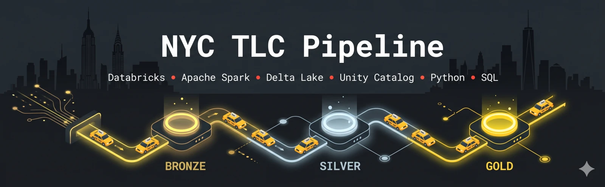

<div align="center">



[](https://github.com/Bruno-Furtado/nyc-tlc-pipeline/actions/workflows/ci.yml) 

      

</div>

<div align="center">
Medallion pipeline for the NYC TLC taxi dataset on Databricks Free Edition.
</div>

---

## 🗂️ Structure
```
src/
├─ pipeline/
│  ├─ config.py       # catalog, spark/logger, landing/bronze helpers, run_sql_file, CDF helpers
│  ├─ 00_setup.py     # provision catalog, schemas, landing volume (runs 00_setup.sql)
│  ├─ 01_download.py  # land TLC parquet into bronze.landing (incremental)
│  ├─ 02_bronze.py    # append new files into bronze Delta, PySpark (source_file lineage, CDF on)
│  ├─ 03_verify.py    # reconcile landing vs bronze row counts (fail-fast)
│  ├─ 04_silver.py    # conform bronze CDF into silver.taxi_trips (incremental, per-taxi watermark)
│  ├─ 05_verify.py    # reconcile bronze vs silver row counts per taxi_type (fail-fast)
│  └─ reset.py        # drop the whole catalog (schemas+tables+volumes+files) for a clean re-test
└─ sql/
   ├─ 00_setup.sql           # catalog, schemas, landing volume
   ├─ 02_bronze.sql          # bronze table comments + tags
   ├─ 04_silver.sql          # silver DDL + metadata (table, CDF, clustering, comments/tags)
   └─ 04_silver_conform.sql  # conform a bronze CDF batch into silver (parametrized per taxi)
analysis/             # the 2 answers and EDA
docs/                 # goals, plan, conventions, data model
```

## 🏗️ Design decisions
Main trade-offs (full rationale in [docs/data-model.md](docs/data-model.md)):
- **Incremental via Delta Change Data Feed**, not a full-scan anti-join and not Auto Loader/DLT (Structured Streaming is limited on Free Edition with Databricks Connect; batch stays reproducible). Scales with the delta, not the table size.
- **Ingestion idempotency is `distinct(source_file)` + an atomic append**, not a `processed` archive or a control table (both can desync on a failed run).
- **OBT (`obt_trips`), not a star schema**, for two simple aggregate questions.
- **Transforms in Spark SQL; PySpark only for ingestion and the CDF plumbing.**

## 🧑‍💻 Dev
Built in VSCode with Claude Code (see `.vscode/extensions.json` for recommended extensions).

Runs locally via Databricks Connect; targets the **dev** catalog (`nyc_tlc_dev`) by default.
```
# 1. virtualenv — must be Python 3.12 (databricks-connect requires it)
python3.12 -m venv .venv && source .venv/bin/activate

# 2. dependencies (runtime + ruff for linting)
pip install -r requirements.txt -r requirements-dev.txt

# 3. Databricks CLI + auth
brew tap databricks/tap && brew install databricks
databricks auth login --host <workspace-url>

# 4. provision the dev catalog (schemas + landing volume, with comments + tags)
python src/pipeline/00_setup.py

# 5. land TLC files, ingest into bronze, verify, build silver, verify (all incremental, safe to rerun)
python src/pipeline/01_download.py
python src/pipeline/02_bronze.py
python src/pipeline/03_verify.py
python src/pipeline/04_silver.py
python src/pipeline/05_verify.py
```

To start from a clean slate, `reset.py` drops the whole target catalog (schemas, tables, volumes,
and staged files); then re-run from step 4:
```
python src/pipeline/reset.py     # destructive, honors NYC_TLC_CATALOG (default nyc_tlc_dev)
```

### Lint
Config in `ruff.toml`. Run before committing:
```
ruff check src/          # report issues
ruff check --fix src/    # auto-fix what's safe (incl. import sorting)
ruff format src/         # format code
```

> No local PySpark/Java/Delta needed, `databricks-connect` ships the client.

## 🚀 Deploy
Free Edition is a single workspace, so dev/prod are isolated by **catalog**:
```
nyc_tlc_dev   # default, local/testing
nyc_tlc       # production, auto-deployed on merge to main
```

### CI
GitHub Actions (`.github/workflows/ci.yml`) runs on every PR:
```
ruff check src/
ruff format --check src/
```

> Merging a PR into `main` runs the pipeline against **prod** automatically.

---

<div align="center">
  <sub>Made with ♥ in Curitiba 🌲 ☔️</sub>
</div>
